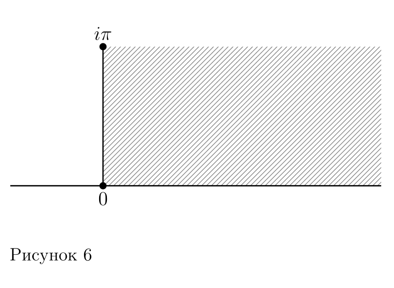
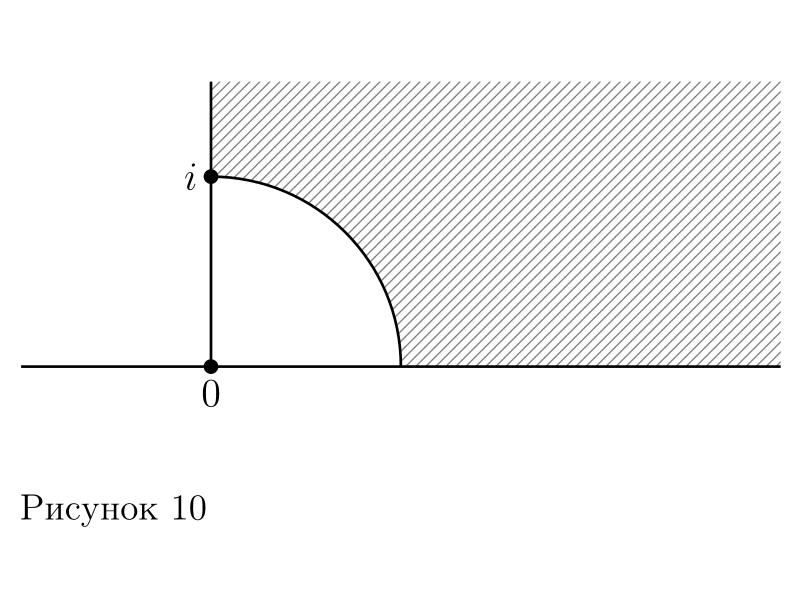

# Построение конформных отображений

## Вариант 18

### Аналитическое описание множеств

$$D_1 = \{z \in \mathbb{C} \mid 0 < \operatorname{Im} z < \pi i, \operatorname{Re} z > 0\}$$

$$D_2 = \{z \in \mathbb{C} \mid \operatorname{Im} z > 0, \operatorname{Re} z > 0, |z| > 1\}$$

### Конформное отображение

Смотреть [здесь](assets/tfkp_lab2_mapping.pdf)

### Обратное отображение

Фактически, мы его составили в процессе доказательства биективности отображения.

$$g(z) = \ln(z) + i \cdot 2\arg(z)$$

